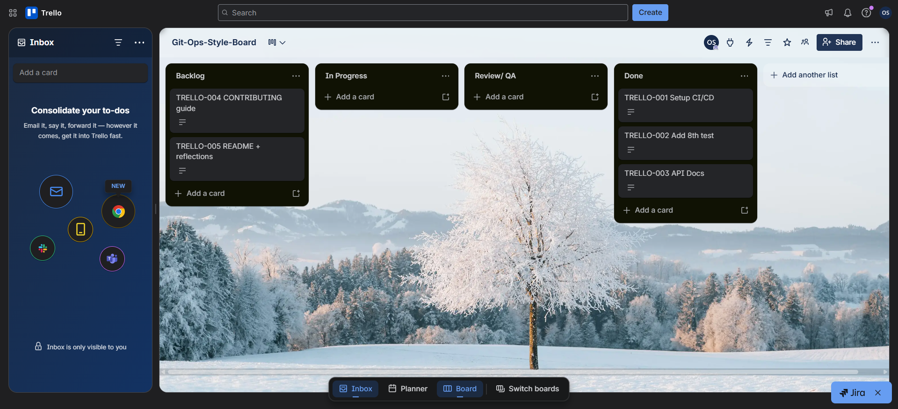
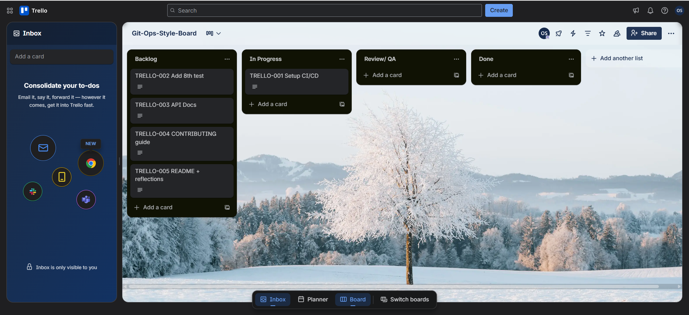
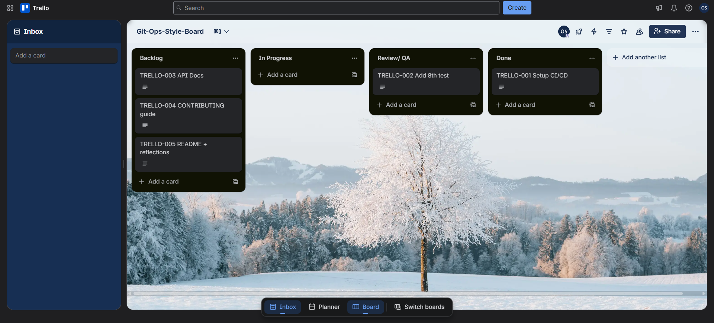
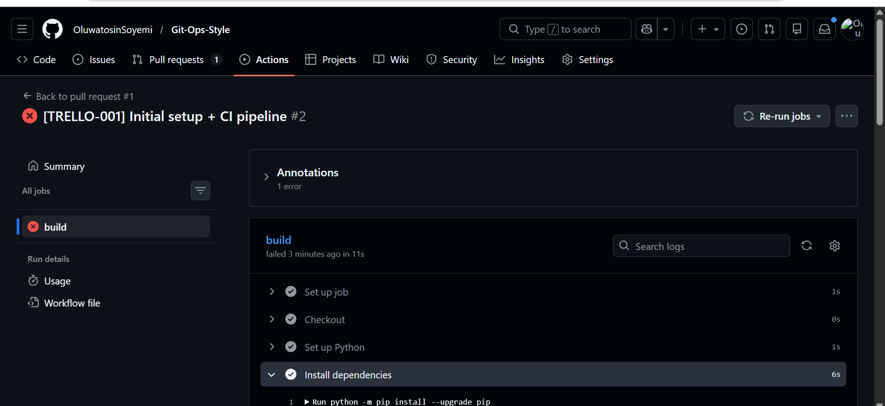
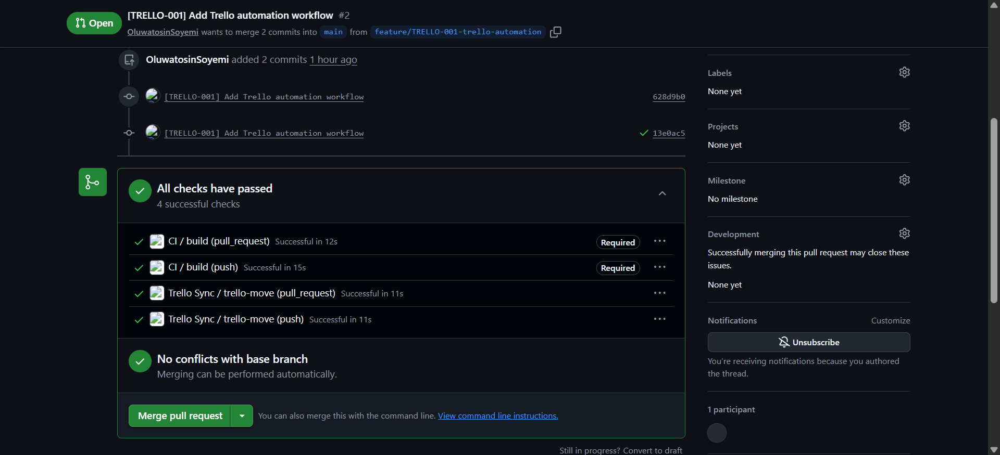
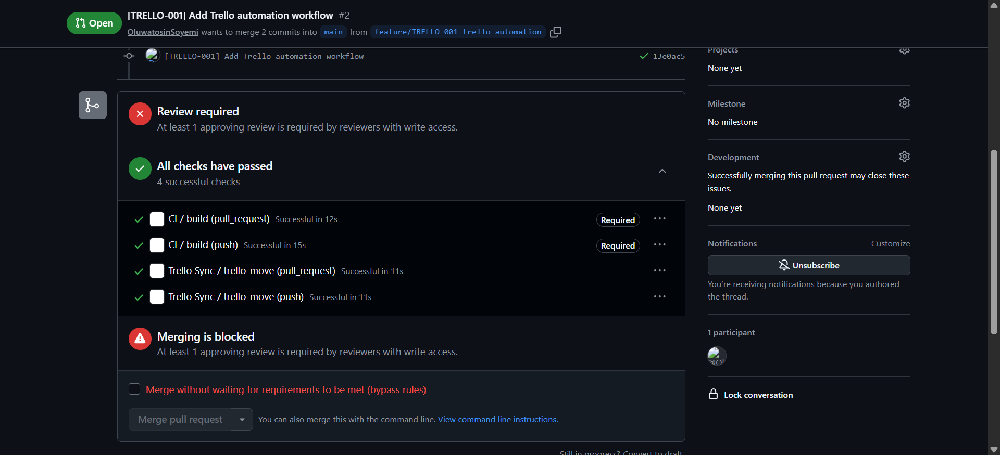
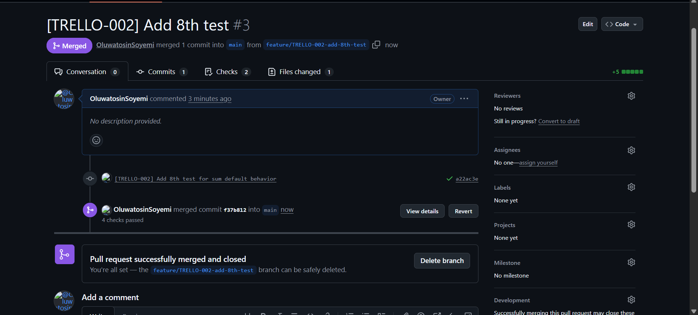
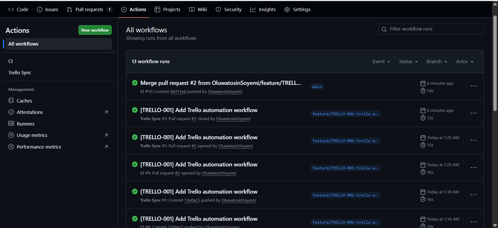

# DevOps GitOps Workflow Project

---

## Project Overview

This project demonstrates a GitOps-style development workflow integrating Trello for task tracking, GitHub for source control, and GitHub Actions for CI/CD automation.

The goal is to ensure code quality, prevent broken code from being merged into the main branch, and provide a structured workflow for collaboration and onboarding.

---

## Architecture

This system connects three main tools:

* Trello → Task tracking and workflow visualization
* GitHub → Source control and version management
* GitHub Actions → Continuous Integration (CI) automation

Workflow:

Trello Card
→ Feature Branch
→ Commit (with Trello ID)
→ Pull Request
→ CI Pipeline (Install → Lint → Test)
→ Merge to main
→ Done

---

## Workflow Description

1. Tasks are created in Trello with unique IDs (e.g., TRELLO-001).
2. Each task is implemented in a feature branch.
3. All commits reference the Trello ID.
4. Pull requests are created for code review.
5. GitHub Actions runs linting and testing automatically.
6. Code is merged only if CI checks pass.
7. Trello cards reflect workflow stages based on development actions(Push, Pull Request and Merge)

---

## Commit Convention

All commits follow this format:

[TRELLO-###] Short description

Example:

[TRELLO-002] Added input validation to /sum endpoint

---

## Setup Instructions

Install dependencies:

pip install -r requirements.txt

Run tests:

pytest -v

Run linting:

flake8 app.py test_app.py

---

## Trello Board

You can view the project task board here:

👉 https://trello.com/b/TuEDVFly/git-ops-style-board

---

## Project Evidence

### Trello Board

### Card in Progress

### Card in Review

### CI Failure (Intentional)

### CI Success

### Merge Blocked (Failed Checks)

### Pull Request Merged

### Successful Workflows

---

## Reflection

### Q1: Branching Strategy

For this project, I implemented a feature-branch workflow where the main branch is kept stable and production-ready at all times. All development work is done in separate feature branches named using the format `feature/TRELLO-###-description`. This ensures that every task is isolated and can be worked on independently without affecting the main branch. The main branch is protected, meaning no direct pushes are allowed, and all changes must go through a pull request process before merging.

This strategy was chosen because it reduces the risk of introducing bugs into the stable codebase. By working in feature branches, developers can experiment and make changes safely without impacting others. It also improves traceability, as each branch is directly linked to a Trello card. This makes it easy to understand what changes were made and why they were made.

Additionally, this workflow supports collaboration and scalability. Even though this project was done individually, the structure reflects how real teams operate. Multiple developers can work on different features simultaneously without conflicts. Overall, the feature-branch strategy ensures better organization, improved code quality, and a safer development process.

---

### Q2: Preventing Bad Code

To prevent bad or broken code from being merged into the main branch, I implemented multiple safeguards using GitHub and CI/CD practices. First, I enforced a rule that no direct pushes are allowed to the main branch. All changes must go through a pull request, which ensures that every update is reviewed before being merged. This adds an extra layer of quality control and prevents careless mistakes.

Second, I set up a GitHub Actions CI pipeline that automatically runs whenever code is pushed or a pull request is created. The pipeline performs three key steps: installing dependencies, running lint checks using flake8, and executing tests using pytest. If any of these steps fail, the build is marked as failed, and the pull request cannot be merged.

I also intentionally triggered a failed build to demonstrate that the system correctly blocks merges when errors occur. This proves that the workflow is working as expected. Additionally, branch protection rules were configured to require passing CI checks before merging. This ensures that only tested and validated code is allowed into the main branch.

Overall, this approach removes reliance on human discipline and replaces it with automated enforcement, ensuring consistent code quality.

---

### Q3: Scaling to 30 Engineers

If this workflow were to scale to a team of 30 engineers, several improvements would be necessary to maintain efficiency and organization. First, I would introduce a CODEOWNERS file to automatically assign reviewers based on the files being modified. This ensures that the right people review the right code, improving quality and reducing review time.

Second, I would enforce stricter pull request rules, such as requiring at least two approvals before merging. This prevents rushed decisions and ensures that multiple perspectives are considered before code is integrated. I would also implement pull request templates to standardize submissions and ensure that all necessary information is provided.

Third, the CI pipeline would be expanded into multiple parallel jobs to improve speed and efficiency. For example, linting, testing, and security checks could run independently. This would provide faster feedback to developers.

Additionally, I would introduce multiple environments such as development, staging, and production. This allows for safer testing before deploying to production. Documentation and onboarding processes would also be improved to help new developers quickly understand the system.

These changes would ensure scalability while maintaining code quality and team productivity.

---

### Q4: Understanding DevOps

This project taught me that DevOps is not just about writing code, but about building reliable systems that ensure quality and consistency. One of the key lessons I learned is the importance of automation. Instead of relying on developers to manually test or review code, automation ensures that every change is validated before being merged. This reduces human error and increases confidence in the system.

I also learned the importance of fast feedback loops. With the CI pipeline in place, every code change is automatically tested and validated. This allows issues to be identified and fixed quickly, preventing them from accumulating over time. Fast feedback improves productivity and helps maintain high code quality.

Another important aspect of DevOps is documentation. By creating clear documentation files such as README, GETTING_STARTED, and CONTRIBUTING, I ensured that new developers can quickly understand and contribute to the project. This is essential for onboarding and long-term maintenance.

Overall, this project helped me understand that DevOps is a combination of automation, collaboration, and continuous improvement. It focuses on delivering reliable software efficiently and maintaining a high standard of quality.

---

### Q5: Trello-Git Correlation

Trello and Git are correlated in this project through the use of unique task IDs. Each Trello card is assigned an ID such as TRELLO-001, and this ID is consistently used throughout the development process. It is included in branch names, commit messages, and pull request titles. This creates a strong link between task tracking and code changes.

For example, a branch might be named `feature/TRELLO-002 Add 8th test`, and commits within that branch would include messages like `[TRELLO-002] Add 8th test for sum default behaviour`. This makes it easy to trace a piece of code back to the task that required it. It also improves accountability, as it is clear which task each change belongs to.

Additionally, Trello cards reflect workflow stages such as Backlog, In Progress, Review/QA, and Done. These stages align with development actions performed in Git, such as pushing code, opening pull requests, and merging changes. This ensures that the status of each task is consistently synchronized with the development process.

This correlation improves transparency, traceability, and organization. It allows developers and reviewers to clearly understand the purpose of each change and ensures that all work is properly tracked.

